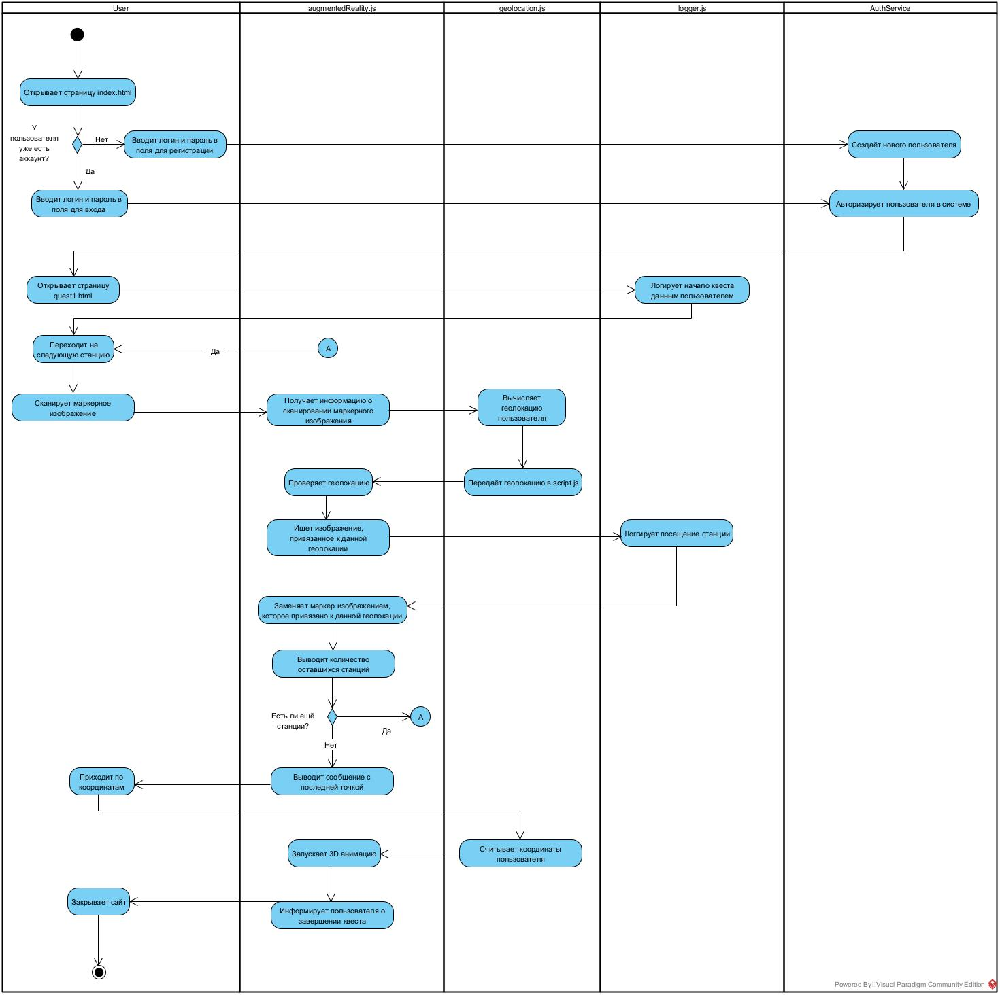

# Анализ-репорт проекта "Квест по станциям"

## Описание проекта
Целью проекта "Квест по станциям" является создание мобильного web-приложения с использованием технологии дополненной реальности (AR). Приложение представляет собой квест, в котором пользователи перемещаются между различными станциями, выполняя задания на каждой станции.

## Методы разработки
Для разработки приложения будет использован следующий подход:
- Итеративная разработка: Разработка будет выполняться путем последовательного добавления и улучшения функциональности в каждой итерации.

## Инструменты проектирования
Для разработки мобильного web-приложения "Квест по станциям" будут использованы следующие инструменты:
- HTML и CSS: Для создания структуры и визуального оформления веб-приложения.
- JavaScript: Для создания логики приложения и взаимодействия с WebXR API.
- WebXR API: Набор JavaScript-интерфейсов, предоставляющих функции для работы с сенсорными данными, отображения 3D-сцен и взаимодействия с объектами AR.
- WebGL: API для рендеринга 3D-графики в браузере, используется для отображения сцен дополненной реальности.
- Библиотеки (например, A-Frame, AR.js и Three.js): Предоставляют готовые компоненты и функциональность для работы с AR.
- Supertokens: это инструмент, который обеспечивает безопасную и масштабируемую систему аутентификации и авторизации для веб-приложений.
- Среда разработки - WebStorm.

## Activity Diagram
Ниже представлена диаграмма, предварительно описывающая основной вариант использования:

### User
Пользователь, взаимодействующий с разрабатываемым Web-приложением

### augmentedReality.js
Набор скриптов, реализующий AR.

### geolocation.js
Набор скриптов, реализующий взаимодействие с геолокацией пользователя.

### logger.js
Набор скриптов, реализующий логирование и документирование действий пользователя.

### AuthService 
Сервис, реализующий аутентификацию и авторизацию пользователей.
